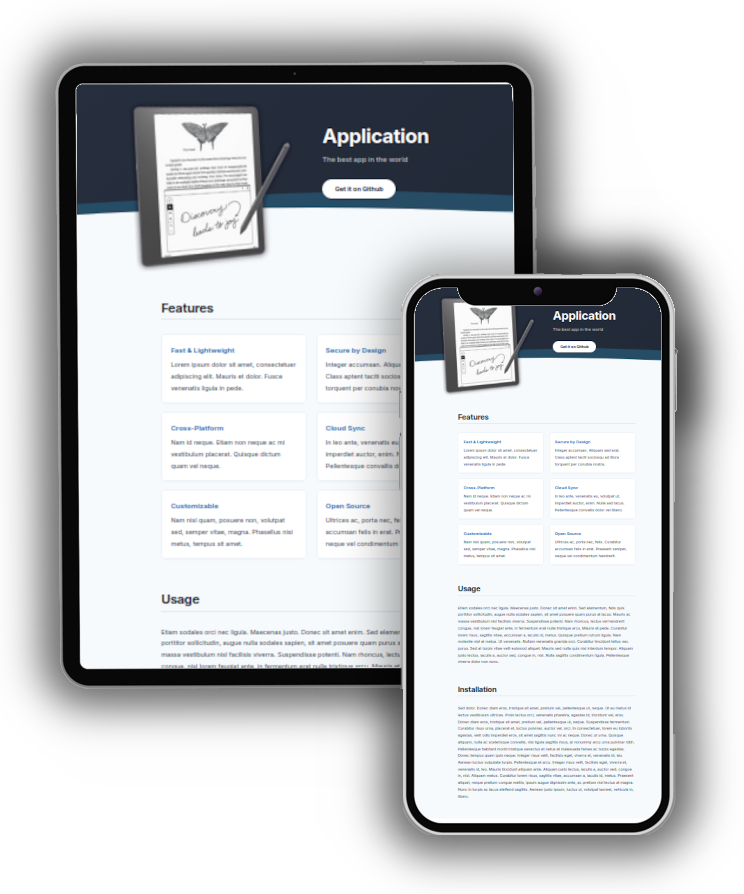

# Applicate - Jekyll Landing Page Theme

Applicate is a modern, responsive landing page theme for software projects or apps, built using the [Jekyll](https://jekyllrb.com/) static site generator. It features a clean, dark-themed header with a wave backdrop, a featured screenshot, and a content-rich body including feature grids, usage instructions, and more.



[**🚀 Live Demo**](https://kbarni.github.io/applicate/)

## Features

- **Fast & Lightweight:** Minimalist design focused on speed and content.
- **Easy Customization:** Configure everything through `_config.yml` and `index.md`.
- **Responsive Design:** Looks great on desktops, tablets, and mobile devices.
- **Modern UI:** Elegant dark header with a wave transition and "Inter" typography.

## Getting Started

### Standalone Usage

1. **Clone the repository:**
   ```bash
   git clone https://github.com/kbarni/applicate.git
   cd applicate
   ```

2. **Customize the content:**
   - Edit `_config.yml` to change the title, subtitle, description, and links.
   - Edit `index.md` to update the features, usage instructions, and changelog.
   - Replace `assets/images/screenshot.png` with your application's screenshot.

3. **Build and serve:**
   ```bash
   jekyll serve
   ```

### As a Remote Theme (GitHub Pages)

You can use this theme for your own repository by using the `jekyll-remote-theme` plugin.

1. Add the following to your `_config.yml`:
   ```yaml
   remote_theme: kbarni/applicate
   plugins:
     - jekyll-remote-theme
   ```

2. Create an `index.md` in your project's root with your content.

## Configuration Options

Edit `_config.yml` to personalize your landing page:

- `title`: The name of your application.
- `subtitle`: A catchy tagline.
- `description`: A brief summary for SEO.
- `header_image`: Path to your main screenshot (default: `assets/images/screenshot.png`).
- `download_url`: Link to your download or GitHub repo.
- `download_text`: The label for the download button.
- `footer_text`: Your copyright or footer message.

## Directory Structure

- `_layouts/default.html`: The master template.
- `assets/css/style.css`: The primary stylesheet.
- `assets/images/`: Store your screenshots and icons here.
- `index.md`: The main content file (Markdown).

## License

This project is open-source and available under the [MIT License](LICENSE).
